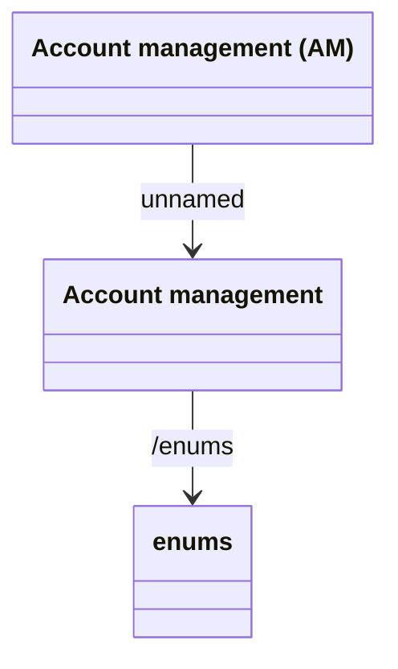

# AM API

```mermaid
classDiagram
    class enums["enums"]
    class Account_management["Account management"]
    class Account_management_AM["Account management (AM)"]
    Account_management --> enums : /enums
    Account_management_AM --> Account_management : unnamed
```
