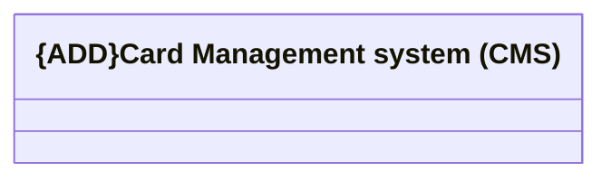

# CMS API

- **Diagram Type**: Logical
- **Package**: HomerSelect/BSL/Modules/Product Catalog (PRC)/Interface Consumed/CMS API
- **Diagram ID**: 156879
- **Elements**: 1
- **Connectors**: 0

```mermaid
classDiagram
    class ADD_Card_Management_system_CMS["{ADD}Card Management system (CMS)"]
```
