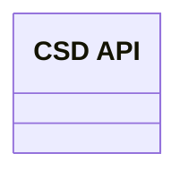

# CSD API

- **Diagram Type**: Logical
- **Package**: HomerSelect/BSL/Modules/Product Catalog (PRC)/Interface Consumed/CSD API
- **Diagram ID**: 146639
- **Elements**: 1
- **Connectors**: 0

```mermaid
classDiagram
    class CSD_API["CSD API"]
```
