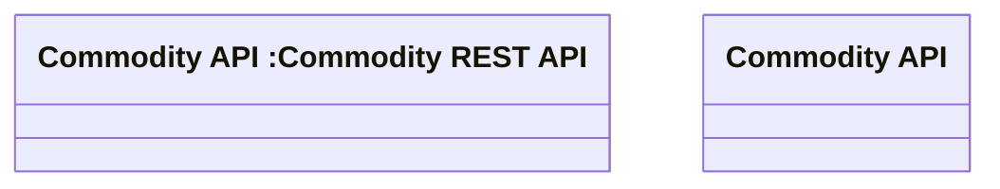

# Commodity API

- **Diagram Type**: Logical
- **Package**: HomerSelect/BSL/Modules/Product Catalog (PRC)/Interface Consumed/Commodity API
- **Diagram ID**: 144976
- **Elements**: 2
- **Connectors**: 0

