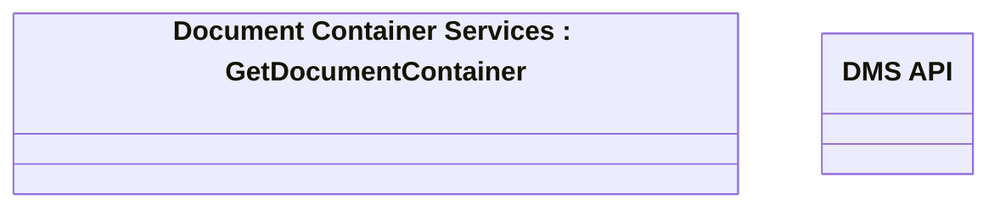

# DMS API

- **Diagram Type**: Logical
- **Package**: HomerSelect/BSL/Modules/Product Catalog (PRC)/Interface Consumed/DMS API
- **Diagram ID**: 142924
- **Elements**: 2
- **Connectors**: 0

```mermaid
classDiagram
    class Document_Container_Services_GetDocumentContainer["Document Container Services : GetDocumentContainer"]
    class DMS_API["DMS API"]
```
