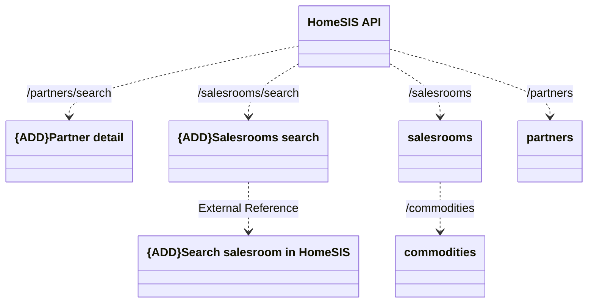

# HomeSIS API

- **Diagram Type**: Logical
- **Package**: HomerSelect/BSL/Modules/Product Catalog (PRC)/Interface Consumed/HomeSIS API
- **Diagram ID**: 163835
- **Elements**: 7
- **Connectors**: 6

