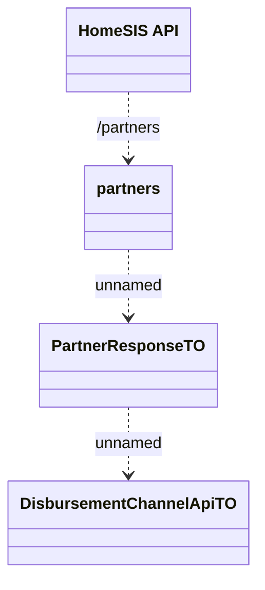

# Partners

- **Diagram Type**: Logical
- **Package**: HomerSelect/BSL/Modules/Product Catalog (PRC)/Interface Consumed/HomeSIS API/Partners
- **Diagram ID**: 132241
- **Elements**: 4
- **Connectors**: 3

