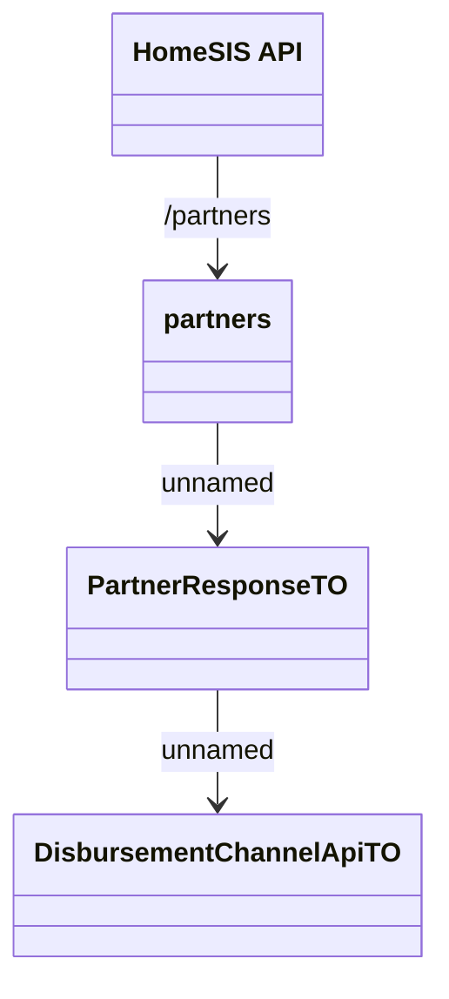

# Partners

```mermaid
classDiagram
    class DisbursementChannelApiTO["DisbursementChannelApiTO"]
    class PartnerResponseTO["PartnerResponseTO"]
    class partners["partners"]
    class HomeSIS_API["HomeSIS API"]
    PartnerResponseTO --> DisbursementChannelApiTO : unnamed
    partners --> PartnerResponseTO : unnamed
    HomeSIS_API --> partners : /partners
```
