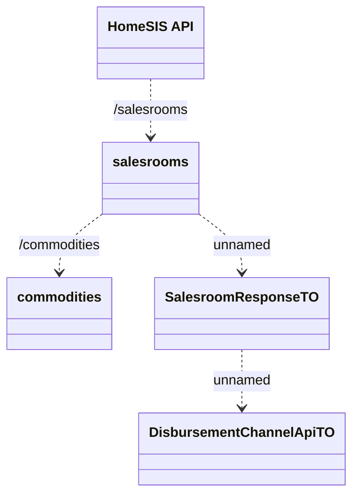

# Salesrooms

- **Diagram Type**: Logical
- **Package**: HomerSelect/BSL/Modules/Product Catalog (PRC)/Interface Consumed/HomeSIS API/Salesrooms
- **Diagram ID**: 132240
- **Elements**: 5
- **Connectors**: 4

