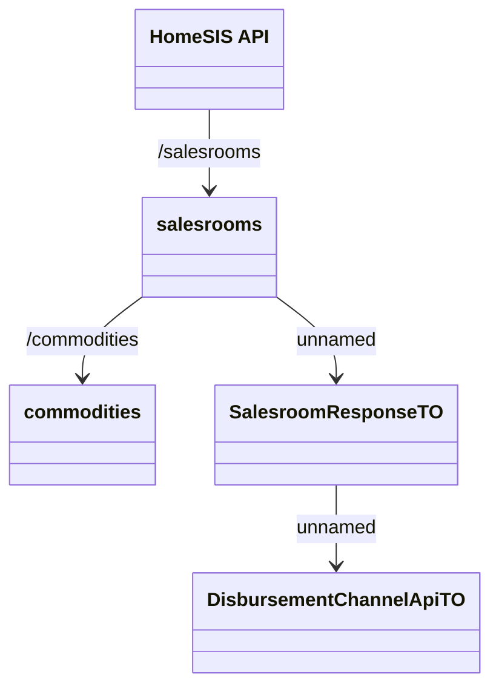

# Salesrooms

```mermaid
classDiagram
    class commodities["commodities"]
    class DisbursementChannelApiTO["DisbursementChannelApiTO"]
    class SalesroomResponseTO["SalesroomResponseTO"]
    class salesrooms["salesrooms"]
    class HomeSIS_API["HomeSIS API"]
    salesrooms --> commodities : /commodities
    SalesroomResponseTO --> DisbursementChannelApiTO : unnamed
    salesrooms --> SalesroomResponseTO : unnamed
    HomeSIS_API --> salesrooms : /salesrooms
```
