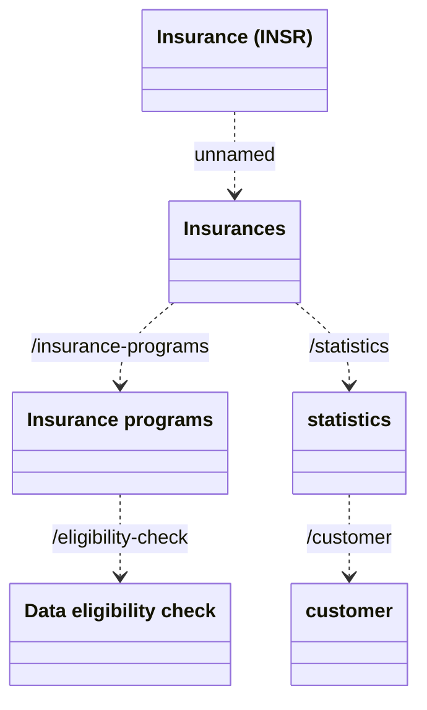

# INSR API

- **Diagram Type**: Logical
- **Package**: HomerSelect/BSL/Modules/Product Catalog (PRC)/Interface Consumed/INSR API
- **Diagram ID**: 144978
- **Elements**: 6
- **Connectors**: 5

```mermaid
classDiagram
    class Data_eligibility_check["Data eligibility check"]
    class customer["customer"]
    class statistics["statistics"]
    class Insurance_programs["Insurance programs"]
    class Insurances["Insurances"]
    class Insurance_INSR["Insurance (INSR)"]
    Insurance_INSR ..> Insurances : unnamed
    Insurances ..> Insurance_programs : /insurance-programs
    Insurances ..> statistics : /statistics
    statistics ..> customer : /customer
    Insurance_programs ..> Data_eligibility_check : /eligibility-check
```
