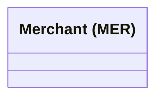

# MER API

- **Diagram Type**: Logical
- **Package**: HomerSelect/BSL/Modules/Product Catalog (PRC)/Interface Consumed/MER API
- **Diagram ID**: 160986
- **Elements**: 1
- **Connectors**: 0

```mermaid
classDiagram
    class Merchant_MER["Merchant (MER)"]
```
