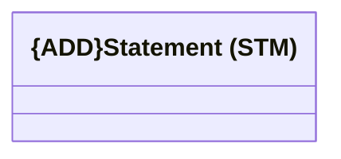

# STM API

- **Diagram Type**: Logical
- **Package**: HomerSelect/BSL/Modules/Product Catalog (PRC)/Interface Consumed/STM API
- **Diagram ID**: 145769
- **Elements**: 1
- **Connectors**: 0

```mermaid
classDiagram
    class ADD_Statement_STM["{ADD}Statement (STM)"]
```
