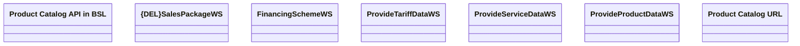

# Interface Provided - overview

```mermaid
classDiagram
    class Product_Catalog_API_in_BSL["Product Catalog API in BSL"]
    class DEL_SalesPackageWS["{DEL}SalesPackageWS"]
    class FinancingSchemeWS["FinancingSchemeWS"]
    class ProvideTariffDataWS["ProvideTariffDataWS"]
    class ProvideServiceDataWS["ProvideServiceDataWS"]
    class ProvideProductDataWS["ProvideProductDataWS"]
    class Product_Catalog_URL["Product Catalog URL"]
```
