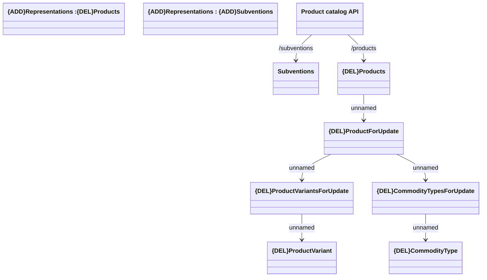

# Product Catalog API in BSL

```mermaid
classDiagram
    class ADD_Representations_DEL_Products["{ADD}Representations :{DEL}Products"]
    class ADD_Representations_ADD_Subventions["{ADD}Representations : {ADD}Subventions"]
    class Subventions["Subventions"]
    class DEL_CommodityType["{DEL}CommodityType"]
    class DEL_ProductVariant["{DEL}ProductVariant"]
    class Product_catalog_API["Product catalog API"]
    class DEL_CommodityTypesForUpdate["{DEL}CommodityTypesForUpdate"]
    class DEL_ProductVariantsForUpdate["{DEL}ProductVariantsForUpdate"]
    class DEL_ProductForUpdate["{DEL}ProductForUpdate"]
    class DEL_Products["{DEL}Products"]
    Product_catalog_API --> DEL_Products : /products
    DEL_Products --> DEL_ProductForUpdate : unnamed
    DEL_ProductForUpdate --> DEL_ProductVariantsForUpdate : unnamed
    DEL_ProductForUpdate --> DEL_CommodityTypesForUpdate : unnamed
    DEL_ProductVariantsForUpdate --> DEL_ProductVariant : unnamed
    DEL_CommodityTypesForUpdate --> DEL_CommodityType : unnamed
    Product_catalog_API --> Subventions : /subventions
```
