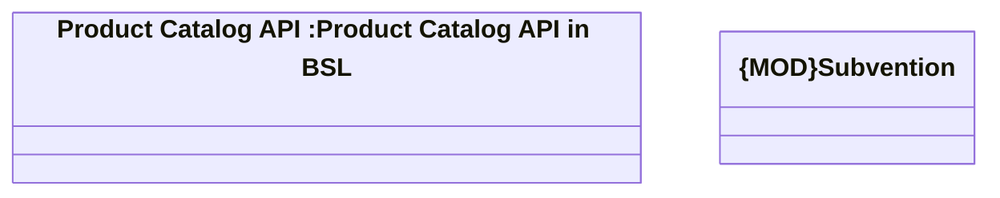

# {ADD}Subventions

- **Diagram Type**: Logical
- **Package**: HomerSelect/BSL/Modules/Product Catalog (PRC)/Interface Provided/Product Catalog API in BSL/Subventions
- **Diagram ID**: 126571
- **Elements**: 2
- **Connectors**: 0

