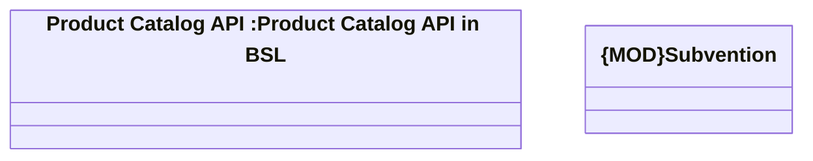

# {ADD}Subventions

```mermaid
classDiagram
    class Product_Catalog_API_Product_Catalog_API_in_BSL["Product Catalog API :Product Catalog API in BSL"]
    class MOD_Subvention["{MOD}Subvention"]
```
