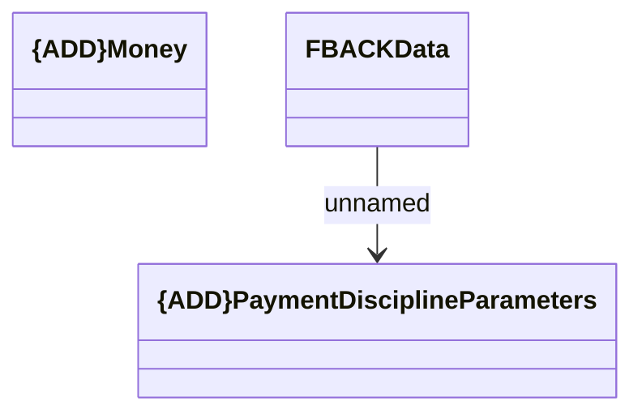

# FBACK Data

```mermaid
classDiagram
    class ADD_Money["{ADD}Money"]
    class ADD_PaymentDisciplineParameters["{ADD}PaymentDisciplineParameters"]
    class FBACKData["FBACKData"]
    FBACKData --> ADD_PaymentDisciplineParameters : unnamed
```
