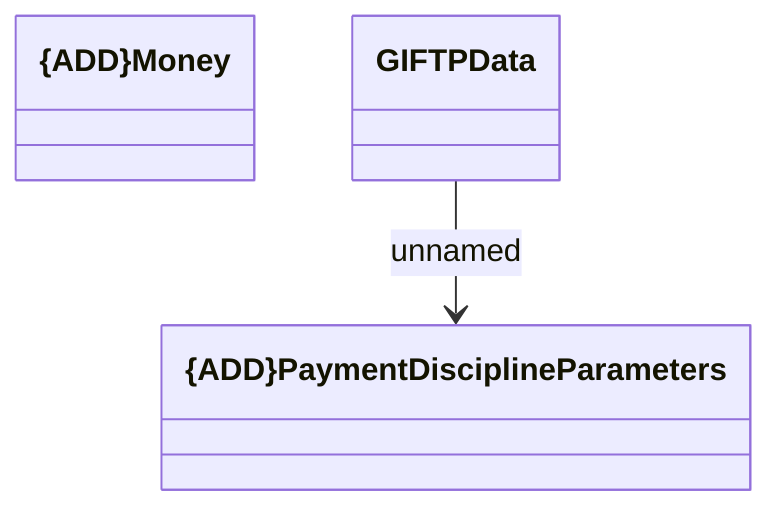

# GIFTP Data

```mermaid
classDiagram
    class ADD_Money["{ADD}Money"]
    class ADD_PaymentDisciplineParameters["{ADD}PaymentDisciplineParameters"]
    class GIFTPData["GIFTPData"]
    GIFTPData --> ADD_PaymentDisciplineParameters : unnamed
```
