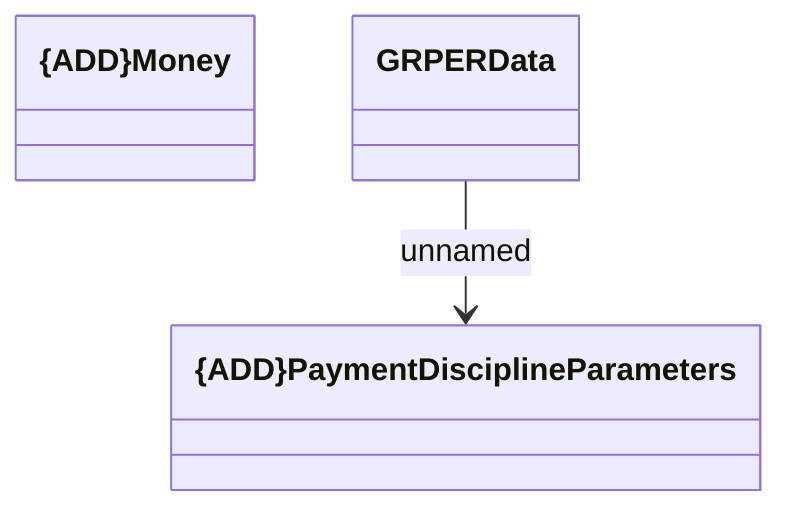

# GRPER Data

```mermaid
classDiagram
    class ADD_Money["{ADD}Money"]
    class ADD_PaymentDisciplineParameters["{ADD}PaymentDisciplineParameters"]
    class GRPERData["GRPERData"]
    GRPERData --> ADD_PaymentDisciplineParameters : unnamed
```
