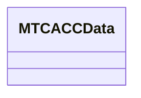

# MTCACC Data

- **Diagram Type**: Logical
- **Package**: HomerSelect/BSL/Modules/Product Catalog (PRC)/Interface Provided/Product Catalog API in BSL/{ADD}Services/MTCACC
- **Diagram ID**: 125513
- **Elements**: 1
- **Connectors**: 0

