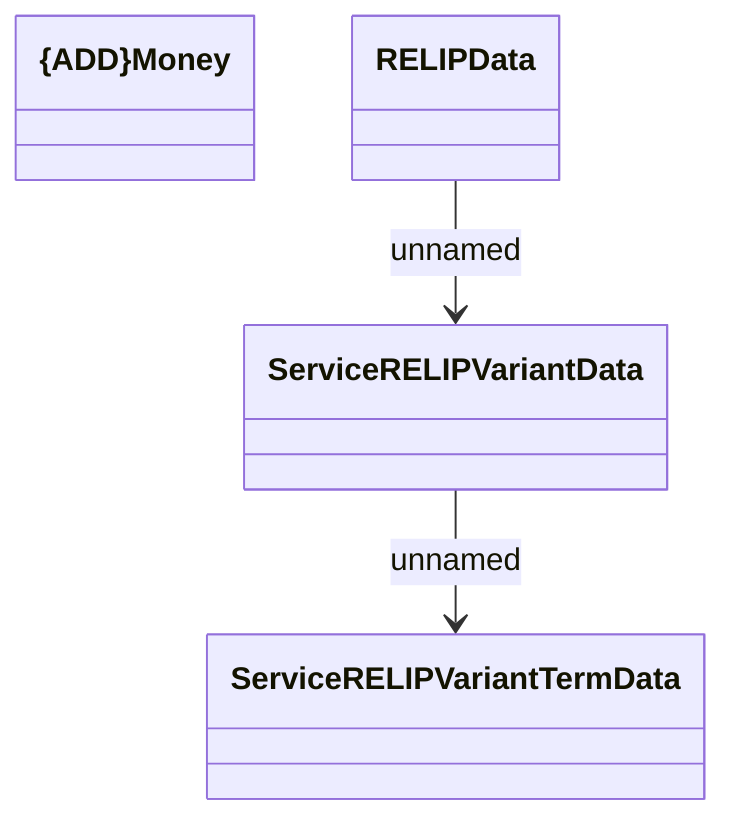

# RELIP Data

```mermaid
classDiagram
    class ADD_Money["{ADD}Money"]
    class ServiceRELIPVariantTermData["ServiceRELIPVariantTermData"]
    class ServiceRELIPVariantData["ServiceRELIPVariantData"]
    class RELIPData["RELIPData"]
    ServiceRELIPVariantData --> ServiceRELIPVariantTermData : unnamed
    RELIPData --> ServiceRELIPVariantData : unnamed
```
