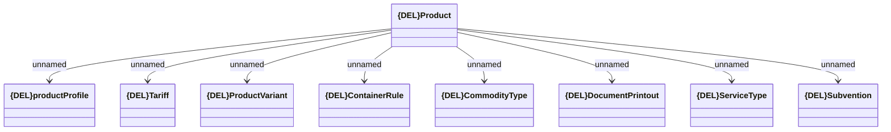

# {DEL}Products

```mermaid
classDiagram
    class DEL_Subvention["{DEL}Subvention"]
    class DEL_ServiceType["{DEL}ServiceType"]
    class DEL_DocumentPrintout["{DEL}DocumentPrintout"]
    class DEL_CommodityType["{DEL}CommodityType"]
    class DEL_ContainerRule["{DEL}ContainerRule"]
    class DEL_ProductVariant["{DEL}ProductVariant"]
    class DEL_Tariff["{DEL}Tariff"]
    class DEL_productProfile["{DEL}productProfile"]
    class DEL_Product["{DEL}Product"]
    DEL_Product --> DEL_productProfile : unnamed
    DEL_Product --> DEL_Tariff : unnamed
    DEL_Product --> DEL_ProductVariant : unnamed
    DEL_Product --> DEL_ContainerRule : unnamed
    DEL_Product --> DEL_CommodityType : unnamed
    DEL_Product --> DEL_DocumentPrintout : unnamed
    DEL_Product --> DEL_ServiceType : unnamed
    DEL_Product --> DEL_Subvention : unnamed
```
