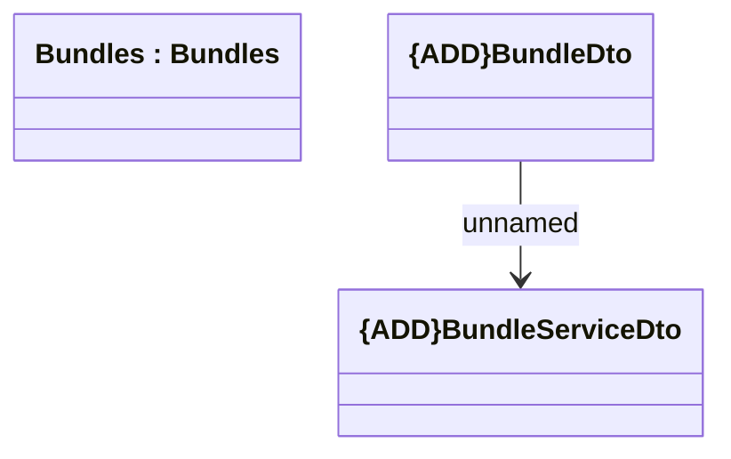

# BundleDto

```mermaid
classDiagram
    class Bundles_Bundles["Bundles : Bundles"]
    class ADD_BundleServiceDto["{ADD}BundleServiceDto"]
    class ADD_BundleDto["{ADD}BundleDto"]
    ADD_BundleDto --> ADD_BundleServiceDto : unnamed
```
