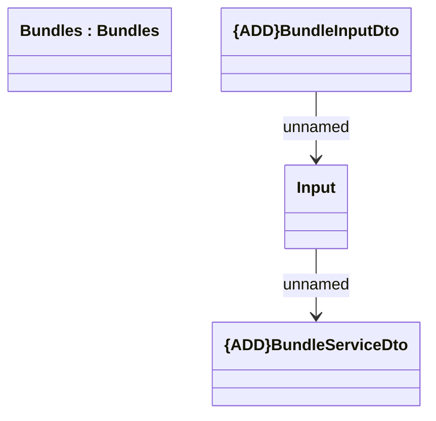

# BundleInputDto

```mermaid
classDiagram
    class Input["Input"]
    class Bundles_Bundles["Bundles : Bundles"]
    class ADD_BundleServiceDto["{ADD}BundleServiceDto"]
    class ADD_BundleInputDto["{ADD}BundleInputDto"]
    ADD_BundleInputDto --> Input : unnamed
    Input --> ADD_BundleServiceDto : unnamed
```
