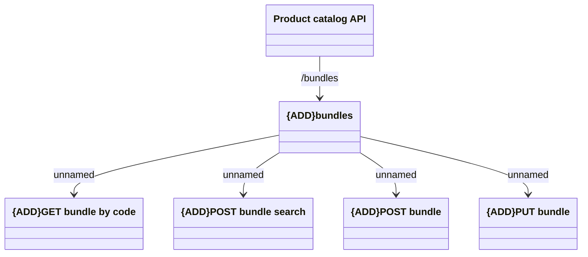

# Bundles API

```mermaid
classDiagram
    class ADD_PUT_bundle["{ADD}PUT bundle"]
    class ADD_POST_bundle["{ADD}POST bundle"]
    class ADD_POST_bundle_search["{ADD}POST bundle search"]
    class ADD_GET_bundle_by_code["{ADD}GET bundle by code"]
    class Product_catalog_API["Product catalog API"]
    class ADD_bundles["{ADD}bundles"]
    ADD_bundles --> ADD_GET_bundle_by_code : unnamed
    ADD_bundles --> ADD_POST_bundle_search : unnamed
    ADD_bundles --> ADD_POST_bundle : unnamed
    ADD_bundles --> ADD_PUT_bundle : unnamed
    Product_catalog_API --> ADD_bundles : /bundles
```
