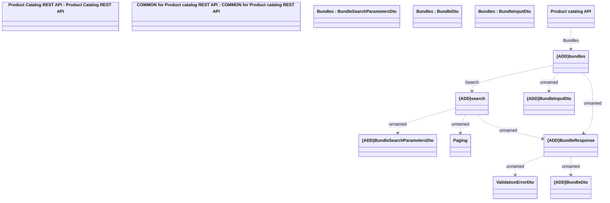

# Bundles

- **Diagram Type**: Logical
- **Package**: HomerSelect/BSL/Modules/Product Catalog (PRC)/Interface Provided/Product Catalog REST API/Bundles
- **Diagram ID**: 160828
- **Elements**: 14
- **Connectors**: 9

