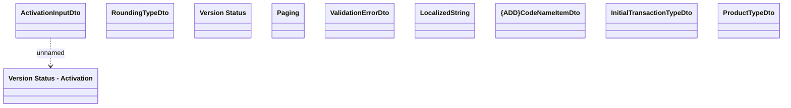

# COMMON for Product catalog REST API

- **Diagram Type**: Logical
- **Package**: HomerSelect/BSL/Modules/Product Catalog (PRC)/Interface Provided/Product Catalog REST API/COMMON for Product catalog REST API
- **Diagram ID**: 163846
- **Elements**: 10
- **Connectors**: 1

