# Code Lists

- **Diagram Type**: Logical
- **Package**: HomerSelect/BSL/Modules/Product Catalog (PRC)/Interface Provided/Product Catalog REST API/Code Lists
- **Diagram ID**: 161072
- **Elements**: 31
- **Connectors**: 27

```mermaid
classDiagram
    class CodeListPromoActionDto["CodeListPromoActionDto"]
    class CodeListModelDto["CodeListModelDto"]
    class ServiceCatalogRoleAssignmentDto["ServiceCatalogRoleAssignmentDto"]
    class Code_Lists_Presented_Interest_Rate_Settings["Code Lists :Presented Interest Rate Settings"]
    class PIRSettingsDto["PIRSettingsDto"]
    class EligibilityCriterionParameterTypeDto["EligibilityCriterionParameterTypeDto"]
    class EligibilityCriterionTypeDto["EligibilityCriterionTypeDto"]
    class InsuranceProgramDto["InsuranceProgramDto"]
    class ServiceCatalogParameterParamDto["ServiceCatalogParameterParamDto"]
    class ServiceCatalogParameterDto["ServiceCatalogParameterDto"]
    class ServiceCatalogCategoryDto["ServiceCatalogCategoryDto"]
    class MOD_ServiceCatalogTypeDto["{MOD}ServiceCatalogTypeDto"]
    class PrintoutTemplateCodeListsItemDto["PrintoutTemplateCodeListsItemDto"]
    class ServiceTypeCodeListsItemDto["ServiceTypeCodeListsItemDto"]
    class CommodityTypeCodeListsItemDto["CommodityTypeCodeListsItemDto"]
    class DocumentContainerCodeListsItemDto["DocumentContainerCodeListsItemDto"]
    class ProductProfilesCodeListItemDto["ProductProfilesCodeListItemDto"]
    class SubventionSchemeDto["SubventionSchemeDto"]
    class QualificationCriteriaAttributeDto["QualificationCriteriaAttributeDto"]
    class ProductSetDto["ProductSetDto"]
    class ADD_CodeNameItemDto["{ADD}CodeNameItemDto"]
    class SimpleCodeListItemDto["SimpleCodeListItemDto"]
    class Code_Lists_Tariff_Item_Type["Code Lists : Tariff Item Type"]
    class TariffItemTypeCodeListItemDto["TariffItemTypeCodeListItemDto"]
    class Code_Lists_Cooling_Off_Period_Scheme["Code Lists : Cooling Off Period Scheme"]
    class Code_Lists_Installment_Plan_Scheme["Code Lists : Installment Plan Scheme"]
    class CoolingOffPeriodSchemeDto["CoolingOffPeriodSchemeDto"]
    class CodeListsDto["CodeListsDto"]
    class InstallmentPlanSchemeDto["InstallmentPlanSchemeDto"]
    class code_list["code-list"]
    class Product_catalog_API["Product catalog API"]
    CodeListsDto ..> CommodityTypeCodeListsItemDto : unnamed
    CodeListsDto ..> CodeListModelDto : unnamed
    MOD_ServiceCatalogTypeDto ..> ServiceCatalogRoleAssignmentDto : unnamed
    CodeListsDto ..> PIRSettingsDto : unnamed
    EligibilityCriterionTypeDto ..> EligibilityCriterionParameterTypeDto : unnamed
    CodeListsDto ..> EligibilityCriterionTypeDto : unnamed
    CodeListsDto ..> InsuranceProgramDto : unnamed
    ServiceCatalogParameterDto ..> ServiceCatalogParameterParamDto : unnamed
    CodeListsDto ..> ServiceCatalogParameterDto : unnamed
    MOD_ServiceCatalogTypeDto ..> ServiceCatalogCategoryDto : unnamed
    CodeListsDto ..> ServiceCatalogCategoryDto : unnamed
    CodeListsDto ..> MOD_ServiceCatalogTypeDto : unnamed
    CodeListsDto ..> CodeListPromoActionDto : unnamed
    CodeListsDto ..> ServiceTypeCodeListsItemDto : unnamed
    CodeListsDto ..> DocumentContainerCodeListsItemDto : unnamed
    CodeListsDto ..> ProductProfilesCodeListItemDto : unnamed
    CodeListsDto ..> SubventionSchemeDto : unnamed
    CodeListsDto ..> QualificationCriteriaAttributeDto : unnamed
    CodeListsDto ..> ProductSetDto : unnamed
    CodeListsDto ..> ADD_CodeNameItemDto : unnamed
    CodeListsDto ..> SimpleCodeListItemDto : unnamed
    CodeListsDto ..> TariffItemTypeCodeListItemDto : unnamed
    CodeListsDto ..> CoolingOffPeriodSchemeDto : unnamed
    code_list ..> CodeListsDto : unnamed
    CodeListsDto ..> InstallmentPlanSchemeDto : unnamed
    CodeListsDto ..> PrintoutTemplateCodeListsItemDto : unnamed
    Product_catalog_API ..> code_list : code-lists
```

