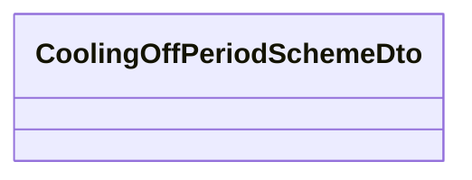

# Cooling Off Period Scheme

- **Diagram Type**: Logical
- **Package**: HomerSelect/BSL/Modules/Product Catalog (PRC)/Interface Provided/Product Catalog REST API/Code Lists
- **Diagram ID**: 161071
- **Elements**: 1
- **Connectors**: 0

