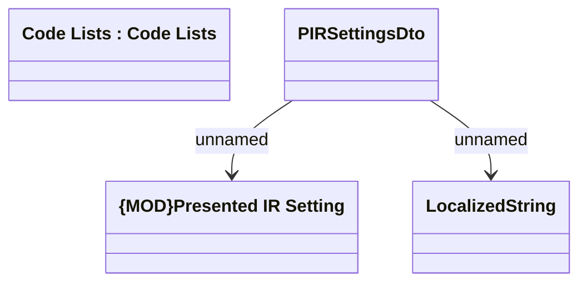

# Presented Interest Rate Settings

```mermaid
classDiagram
    class LocalizedString["LocalizedString"]
    class Code_Lists_Code_Lists["Code Lists : Code Lists"]
    class MOD_Presented_IR_Setting["{MOD}Presented IR Setting"]
    class PIRSettingsDto["PIRSettingsDto"]
    PIRSettingsDto --> MOD_Presented_IR_Setting : unnamed
    PIRSettingsDto --> LocalizedString : unnamed
```
