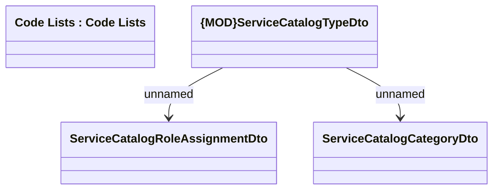

# Service catalog type

```mermaid
classDiagram
    class Code_Lists_Code_Lists["Code Lists : Code Lists"]
    class ServiceCatalogRoleAssignmentDto["ServiceCatalogRoleAssignmentDto"]
    class MOD_ServiceCatalogTypeDto["{MOD}ServiceCatalogTypeDto"]
    class ServiceCatalogCategoryDto["ServiceCatalogCategoryDto"]
    MOD_ServiceCatalogTypeDto --> ServiceCatalogRoleAssignmentDto : unnamed
    MOD_ServiceCatalogTypeDto --> ServiceCatalogCategoryDto : unnamed
```
