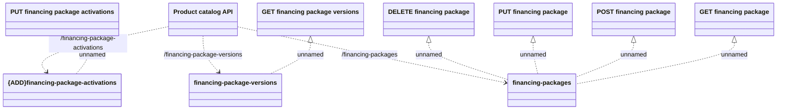

# Financing Packages API

- **Diagram Type**: Logical
- **Package**: HomerSelect/BSL/Modules/Product Catalog (PRC)/Interface Provided/Product Catalog REST API/Financing Packages
- **Diagram ID**: 162531
- **Elements**: 10
- **Connectors**: 9

