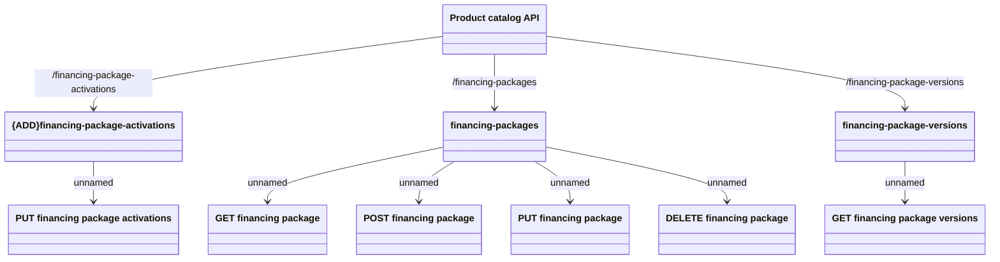

# Financing Packages API

```mermaid
classDiagram
    class ADD_financing_package_activations["{ADD}financing-package-activations"]
    class PUT_financing_package_activations["PUT financing package activations"]
    class GET_financing_package_versions["GET financing package versions"]
    class DELETE_financing_package["DELETE financing package"]
    class PUT_financing_package["PUT financing package"]
    class POST_financing_package["POST financing package"]
    class GET_financing_package["GET financing package"]
    class financing_package_versions["financing-package-versions"]
    class financing_packages["financing-packages"]
    class Product_catalog_API["Product catalog API"]
    financing_packages --> GET_financing_package : unnamed
    financing_packages --> POST_financing_package : unnamed
    financing_packages --> PUT_financing_package : unnamed
    financing_packages --> DELETE_financing_package : unnamed
    financing_package_versions --> GET_financing_package_versions : unnamed
    ADD_financing_package_activations --> PUT_financing_package_activations : unnamed
    Product_catalog_API --> ADD_financing_package_activations : /financing-package-activations
    Product_catalog_API --> financing_packages : /financing-packages
    Product_catalog_API --> financing_package_versions : /financing-package-versions
```
