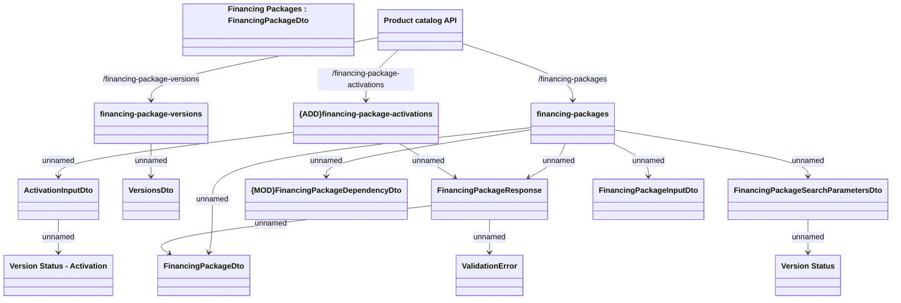

# Financing Packages

```mermaid
classDiagram
    class Version_Status_Activation["Version Status - Activation"]
    class ActivationInputDto["ActivationInputDto"]
    class ADD_financing_package_activations["{ADD}financing-package-activations"]
    class Version_Status["Version Status"]
    class VersionsDto["VersionsDto"]
    class financing_package_versions["financing-package-versions"]
    class ValidationError["ValidationError"]
    class FinancingPackageResponse["FinancingPackageResponse"]
    class MOD_FinancingPackageDependencyDto["{MOD}FinancingPackageDependencyDto"]
    class FinancingPackageSearchParametersDto["FinancingPackageSearchParametersDto"]
    class Financing_Packages_FinancingPackageDto["Financing Packages : FinancingPackageDto"]
    class FinancingPackageInputDto["FinancingPackageInputDto"]
    class FinancingPackageDto["FinancingPackageDto"]
    class financing_packages["financing-packages"]
    class Product_catalog_API["Product catalog API"]
    financing_packages --> FinancingPackageDto : unnamed
    FinancingPackageResponse --> FinancingPackageDto : unnamed
    financing_packages --> FinancingPackageInputDto : unnamed
    financing_packages --> FinancingPackageSearchParametersDto : unnamed
    financing_packages --> MOD_FinancingPackageDependencyDto : unnamed
    financing_packages --> FinancingPackageResponse : unnamed
    ADD_financing_package_activations --> FinancingPackageResponse : unnamed
    FinancingPackageResponse --> ValidationError : unnamed
    financing_package_versions --> VersionsDto : unnamed
    FinancingPackageSearchParametersDto --> Version_Status : unnamed
    ADD_financing_package_activations --> ActivationInputDto : unnamed
    Product_catalog_API --> ADD_financing_package_activations : /financing-package-activations
    Product_catalog_API --> financing_packages : /financing-packages
    Product_catalog_API --> financing_package_versions : /financing-package-versions
    ActivationInputDto --> Version_Status_Activation : unnamed
```
