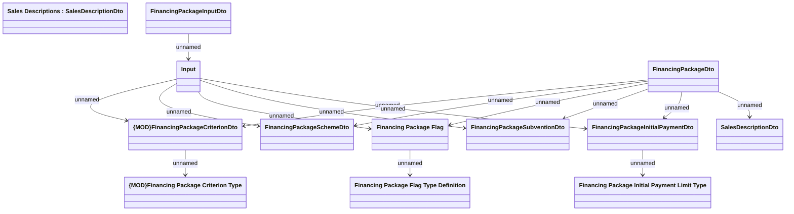

# FinancingPackageDto

```mermaid
classDiagram
    class Sales_Descriptions_SalesDescriptionDto["Sales Descriptions : SalesDescriptionDto"]
    class SalesDescriptionDto["SalesDescriptionDto"]
    class Input["Input"]
    class Financing_Package_Initial_Payment_Limit_Type["Financing Package Initial Payment Limit Type"]
    class FinancingPackageInitialPaymentDto["FinancingPackageInitialPaymentDto"]
    class FinancingPackageInputDto["FinancingPackageInputDto"]
    class FinancingPackageSubventionDto["FinancingPackageSubventionDto"]
    class Financing_Package_Flag["Financing Package Flag"]
    class Financing_Package_Flag_Type_Definition["Financing Package Flag Type Definition"]
    class FinancingPackageSchemeDto["FinancingPackageSchemeDto"]
    class MOD_Financing_Package_Criterion_Type["{MOD}Financing Package Criterion Type"]
    class MOD_FinancingPackageCriterionDto["{MOD}FinancingPackageCriterionDto"]
    class FinancingPackageDto["FinancingPackageDto"]
    FinancingPackageDto --> MOD_FinancingPackageCriterionDto : unnamed
    Input --> MOD_FinancingPackageCriterionDto : unnamed
    MOD_FinancingPackageCriterionDto --> MOD_Financing_Package_Criterion_Type : unnamed
    Input --> FinancingPackageSchemeDto : unnamed
    FinancingPackageDto --> FinancingPackageSchemeDto : unnamed
    Financing_Package_Flag --> Financing_Package_Flag_Type_Definition : unnamed
    Input --> Financing_Package_Flag : unnamed
    FinancingPackageDto --> Financing_Package_Flag : unnamed
    FinancingPackageDto --> FinancingPackageSubventionDto : unnamed
    Input --> FinancingPackageSubventionDto : unnamed
    FinancingPackageDto --> FinancingPackageInitialPaymentDto : unnamed
    Input --> FinancingPackageInitialPaymentDto : unnamed
    FinancingPackageInitialPaymentDto --> Financing_Package_Initial_Payment_Limit_Type : unnamed
    FinancingPackageInputDto --> Input : unnamed
    FinancingPackageDto --> SalesDescriptionDto : unnamed
```
