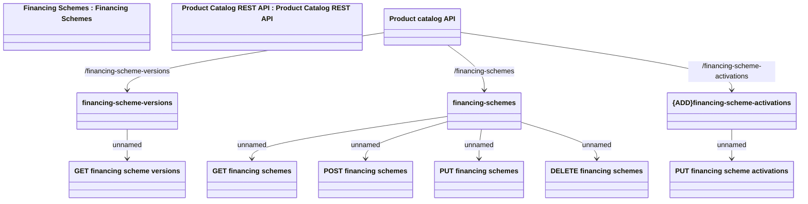

# Financing Schemes API

```mermaid
classDiagram
    class PUT_financing_scheme_activations["PUT financing scheme activations"]
    class ADD_financing_scheme_activations["{ADD}financing-scheme-activations"]
    class GET_financing_scheme_versions["GET financing scheme versions"]
    class financing_scheme_versions["financing-scheme-versions"]
    class Financing_Schemes_Financing_Schemes["Financing Schemes : Financing Schemes"]
    class Product_Catalog_REST_API_Product_Catalog_REST_API["Product Catalog REST API : Product Catalog REST API"]
    class DELETE_financing_schemes["DELETE financing schemes"]
    class PUT_financing_schemes["PUT financing schemes"]
    class POST_financing_schemes["POST financing schemes"]
    class GET_financing_schemes["GET financing schemes"]
    class Product_catalog_API["Product catalog API"]
    class financing_schemes["financing-schemes"]
    financing_schemes --> GET_financing_schemes : unnamed
    financing_schemes --> POST_financing_schemes : unnamed
    financing_schemes --> PUT_financing_schemes : unnamed
    financing_schemes --> DELETE_financing_schemes : unnamed
    financing_scheme_versions --> GET_financing_scheme_versions : unnamed
    ADD_financing_scheme_activations --> PUT_financing_scheme_activations : unnamed
    Product_catalog_API --> financing_scheme_versions : /financing-scheme-versions
    Product_catalog_API --> financing_schemes : /financing-schemes
    Product_catalog_API --> ADD_financing_scheme_activations : /financing-scheme-activations
```
