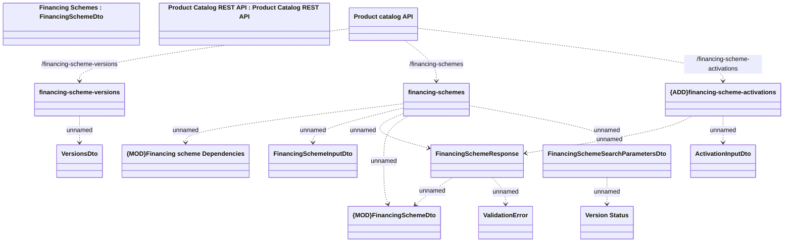

# Financing Schemes

- **Diagram Type**: Logical
- **Package**: HomerSelect/BSL/Modules/Product Catalog (PRC)/Interface Provided/Product Catalog REST API/Financing Schemes
- **Diagram ID**: 159438
- **Elements**: 15
- **Connectors**: 14

