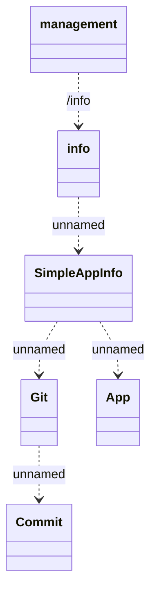

# Management info

- **Diagram Type**: Logical
- **Package**: HomerSelect/BSL/Modules/Product Catalog (PRC)/Interface Provided/Product Catalog REST API/Management
- **Diagram ID**: 138910
- **Elements**: 6
- **Connectors**: 5

