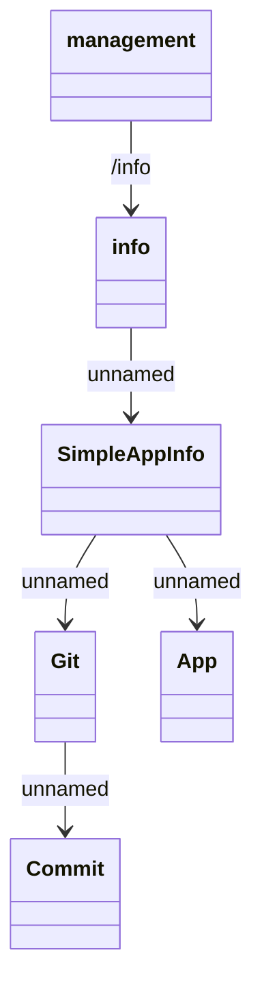

# Management info

```mermaid
classDiagram
    class Commit["Commit"]
    class Git["Git"]
    class App["App"]
    class SimpleAppInfo["SimpleAppInfo"]
    class info["info"]
    class management["management"]
    management --> info : /info
    info --> SimpleAppInfo : unnamed
    SimpleAppInfo --> App : unnamed
    SimpleAppInfo --> Git : unnamed
    Git --> Commit : unnamed
```
