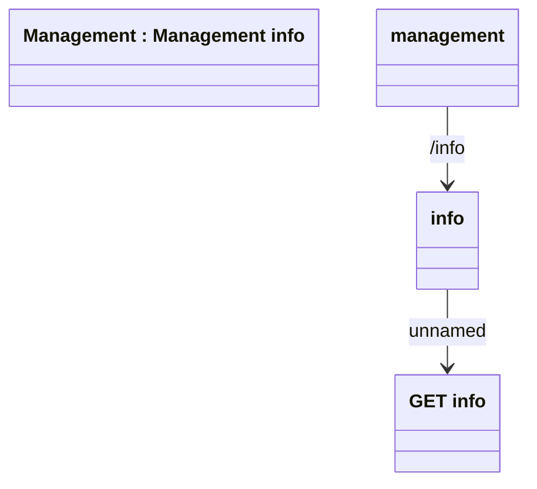

# Management

```mermaid
classDiagram
    class Management_Management_info["Management : Management info"]
    class GET_info["GET info"]
    class info["info"]
    class management["management"]
    management --> info : /info
    info --> GET_info : unnamed
```
