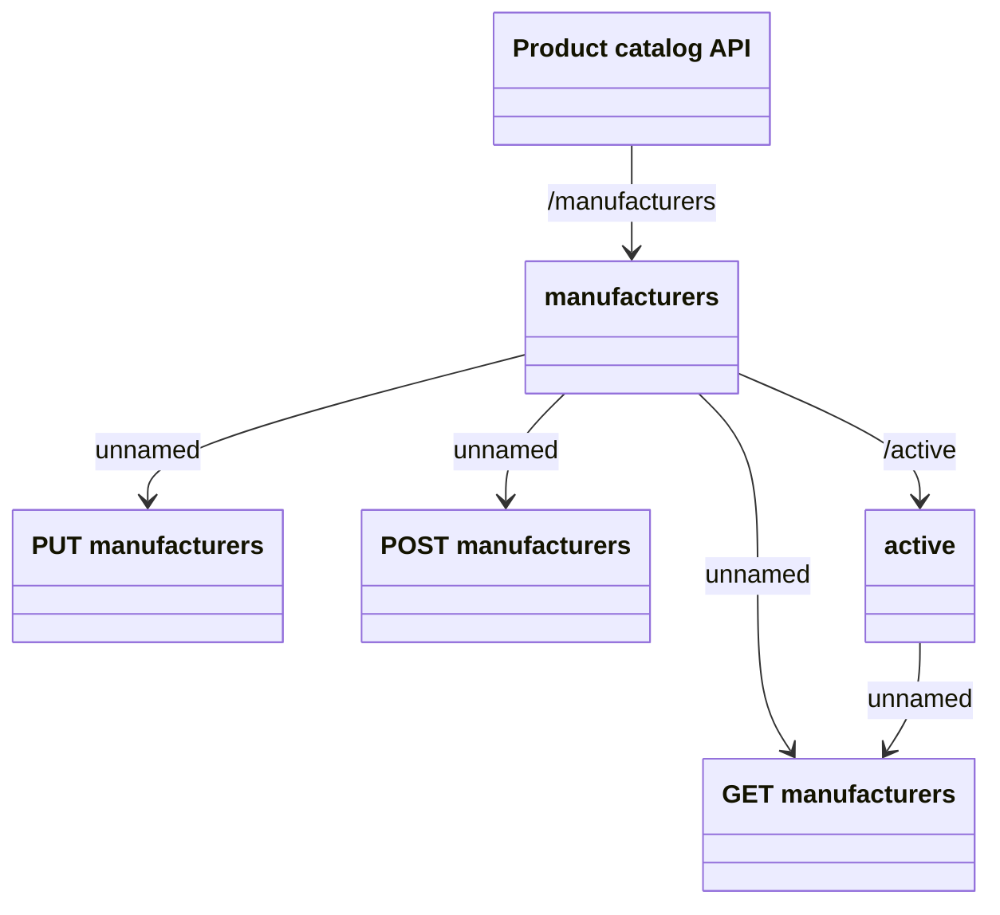

# Manufacturer API

```mermaid
classDiagram
    class PUT_manufacturers["PUT manufacturers"]
    class POST_manufacturers["POST manufacturers"]
    class GET_manufacturers["GET manufacturers"]
    class active["active"]
    class manufacturers["manufacturers"]
    class Product_catalog_API["Product catalog API"]
    manufacturers --> active : /active
    manufacturers --> GET_manufacturers : unnamed
    active --> GET_manufacturers : unnamed
    manufacturers --> POST_manufacturers : unnamed
    manufacturers --> PUT_manufacturers : unnamed
    Product_catalog_API --> manufacturers : /manufacturers
```
