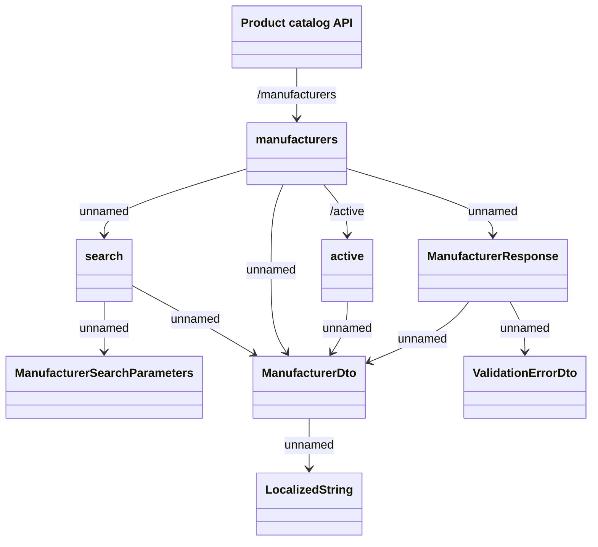

# Manufacturer

```mermaid
classDiagram
    class ManufacturerSearchParameters["ManufacturerSearchParameters"]
    class search["search"]
    class ValidationErrorDto["ValidationErrorDto"]
    class ManufacturerResponse["ManufacturerResponse"]
    class active["active"]
    class LocalizedString["LocalizedString"]
    class ManufacturerDto["ManufacturerDto"]
    class manufacturers["manufacturers"]
    class Product_catalog_API["Product catalog API"]
    search --> ManufacturerSearchParameters : unnamed
    manufacturers --> search : unnamed
    manufacturers --> ManufacturerDto : unnamed
    search --> ManufacturerDto : unnamed
    active --> ManufacturerDto : unnamed
    ManufacturerResponse --> ManufacturerDto : unnamed
    ManufacturerDto --> LocalizedString : unnamed
    manufacturers --> active : /active
    manufacturers --> ManufacturerResponse : unnamed
    ManufacturerResponse --> ValidationErrorDto : unnamed
    Product_catalog_API --> manufacturers : /manufacturers
```
