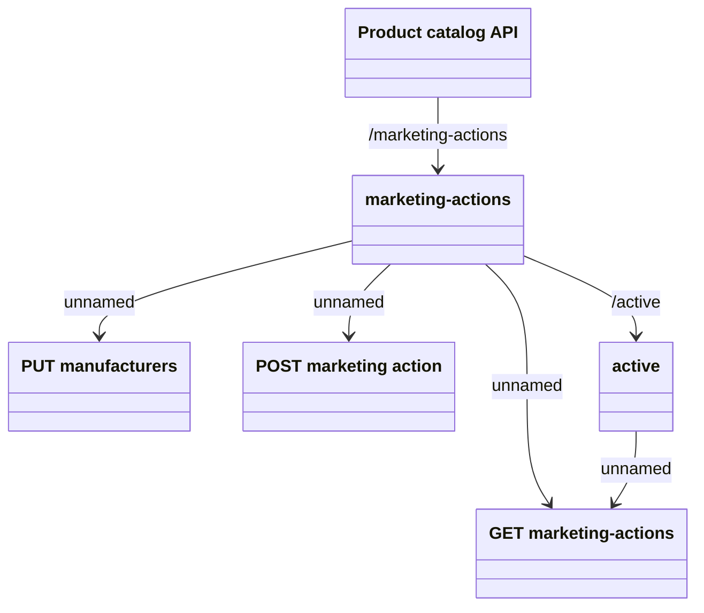

# Marketing Action API

```mermaid
classDiagram
    class PUT_manufacturers["PUT manufacturers"]
    class POST_marketing_action["POST marketing action"]
    class GET_marketing_actions["GET marketing-actions"]
    class active["active"]
    class marketing_actions["marketing-actions"]
    class Product_catalog_API["Product catalog API"]
    marketing_actions --> active : /active
    marketing_actions --> GET_marketing_actions : unnamed
    active --> GET_marketing_actions : unnamed
    marketing_actions --> POST_marketing_action : unnamed
    marketing_actions --> PUT_manufacturers : unnamed
    Product_catalog_API --> marketing_actions : /marketing-actions
```
