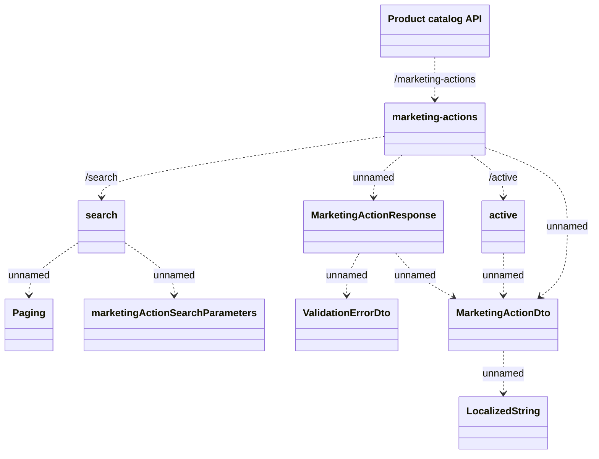

# Marketing Action

- **Diagram Type**: Logical
- **Package**: HomerSelect/BSL/Modules/Product Catalog (PRC)/Interface Provided/Product Catalog REST API/Marketing Action
- **Diagram ID**: 148206
- **Elements**: 10
- **Connectors**: 11

