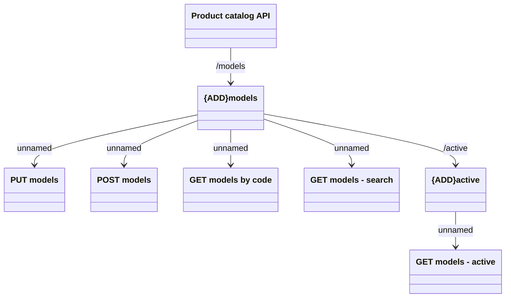

# Model API

```mermaid
classDiagram
    class PUT_models["PUT models"]
    class POST_models["POST models"]
    class GET_models_by_code["GET models by code"]
    class GET_models_active["GET models - active"]
    class GET_models_search["GET models - search"]
    class ADD_active["{ADD}active"]
    class ADD_models["{ADD}models"]
    class Product_catalog_API["Product catalog API"]
    ADD_models --> ADD_active : /active
    ADD_models --> GET_models_search : unnamed
    ADD_active --> GET_models_active : unnamed
    ADD_models --> GET_models_by_code : unnamed
    ADD_models --> POST_models : unnamed
    ADD_models --> PUT_models : unnamed
    Product_catalog_API --> ADD_models : /models
```
