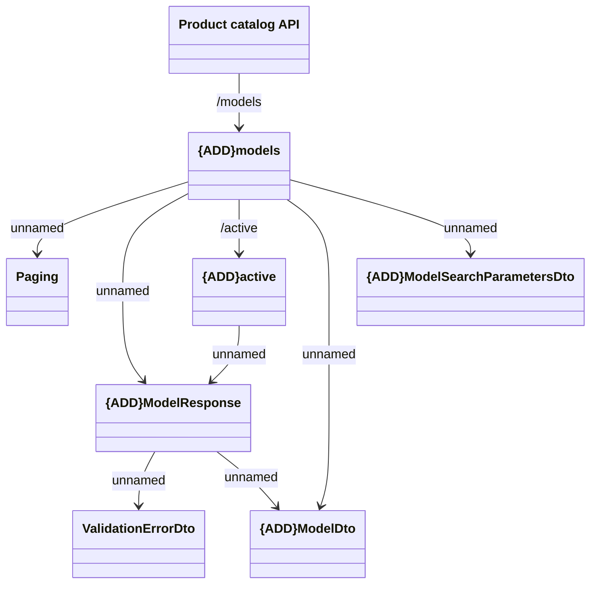

# Model

```mermaid
classDiagram
    class Paging["Paging"]
    class ADD_ModelSearchParametersDto["{ADD}ModelSearchParametersDto"]
    class ADD_ModelDto["{ADD}ModelDto"]
    class ADD_active["{ADD}active"]
    class ValidationErrorDto["ValidationErrorDto"]
    class ADD_ModelResponse["{ADD}ModelResponse"]
    class ADD_models["{ADD}models"]
    class Product_catalog_API["Product catalog API"]
    ADD_models --> Paging : unnamed
    ADD_models --> ADD_ModelResponse : unnamed
    ADD_active --> ADD_ModelResponse : unnamed
    ADD_ModelResponse --> ValidationErrorDto : unnamed
    ADD_models --> ADD_active : /active
    ADD_models --> ADD_ModelDto : unnamed
    ADD_ModelResponse --> ADD_ModelDto : unnamed
    ADD_models --> ADD_ModelSearchParametersDto : unnamed
    Product_catalog_API --> ADD_models : /models
```
