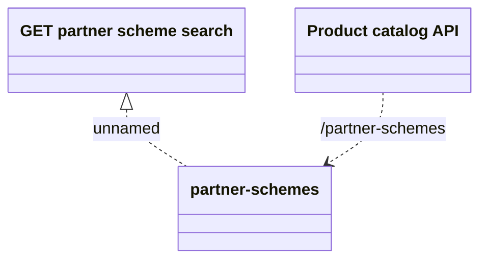

# Partner Scheme API

- **Diagram Type**: Logical
- **Package**: HomerSelect/BSL/Modules/Product Catalog (PRC)/Interface Provided/Product Catalog REST API/Partner Scheme
- **Diagram ID**: 161251
- **Elements**: 3
- **Connectors**: 2

