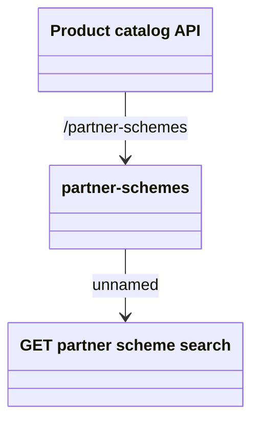

# Partner Scheme API

```mermaid
classDiagram
    class Product_catalog_API["Product catalog API"]
    class partner_schemes["partner-schemes"]
    class GET_partner_scheme_search["GET partner scheme search"]
    partner_schemes --> GET_partner_scheme_search : unnamed
    Product_catalog_API --> partner_schemes : /partner-schemes
```
