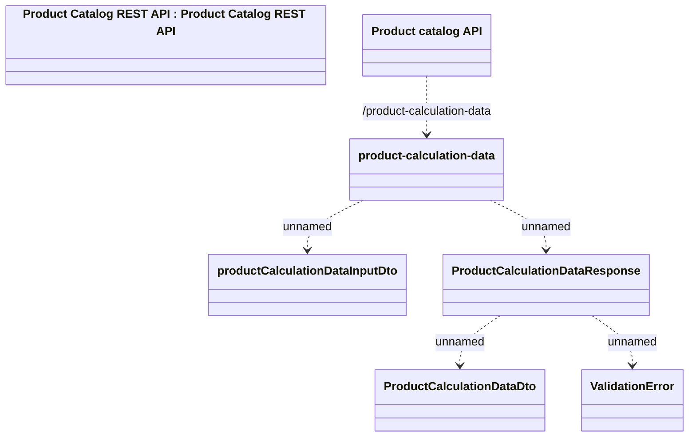

# Product Calculation Data

- **Diagram Type**: Logical
- **Package**: HomerSelect/BSL/Modules/Product Catalog (PRC)/Interface Provided/Product Catalog REST API/Product Calculation Data
- **Diagram ID**: 138997
- **Elements**: 7
- **Connectors**: 5

